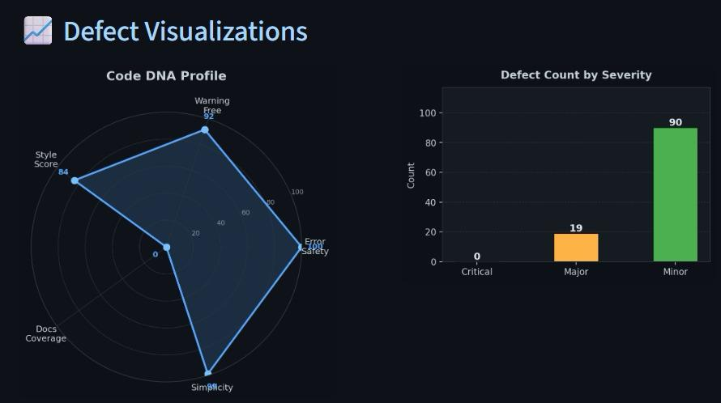
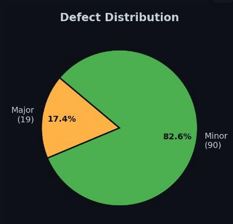

# Code Review Analytics System

## Overview
A software quality analysis system developed to identify, classify, and visualize code defects. The project generates defect analytics and quality metrics to help developers improve code reliability and maintainability.

## Technologies Used
- Python
- Pandas
- Matplotlib
- CSV Data Processing

## Features
- Defect classification and analysis
- Severity-based defect distribution
- Interactive visual dashboards
- Code quality metrics visualization
- Historical defect tracking

## Project Artifacts
- Software Requirements Specification (SRS)
- Use Case Diagram
- Sequence Diagram
- State Diagram
- Research Paper

## Screenshots
### Defect Visualization Dashboard

### Defect Distribution Analysis

## Future Improvements
- Machine Learning based defect prediction
- Real-time code analysis
- Web dashboard integration
- Automated reporting
